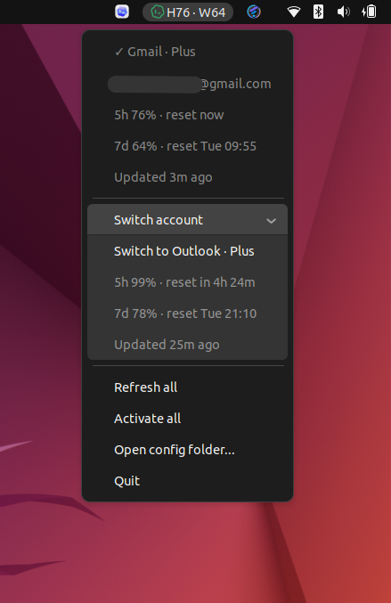

# codex-quota-linux

Minimal Linux AppIndicator for watching and switching Codex account quota.

This is an unofficial personal utility, not an OpenAI or Codex project. It
depends on unstable Codex internal API surfaces, may break
without notice, and is not guaranteed to be maintained promptly.

## Features

- Shows current account 5h and weekly quota in the Linux top bar.
- Monitors multiple saved Codex account quotas.
- Soft-switches the local Codex auth file between account slots.
- Sends a tiny Codex request to activate 5h rolling windows for saved accounts.
- Exposes common actions from the tray menu: switch account, refresh all,
  activate all, open config folder, and quit.



## Requirements

- Linux desktop with AppIndicator support
- `codex` CLI available on `PATH`
- Python 3.10+
- Python GTK / Ayatana AppIndicator bindings from your Linux distribution

If you only need a terminal status line, Codex CLI already has user-configurable
statusline support. This project is mainly for Linux desktop tray workflows,
especially users of
[ilysenko/codex-desktop-linux](https://github.com/ilysenko/codex-desktop-linux)
or similar Codex Desktop Linux setups who want a compact always-visible quota
view. It was developed on Ubuntu 22.04 with Codex Desktop Linux; other
distributions are untested.

```bash
./codex-quota doctor
```

## Usage

Run from a source checkout:

```bash
./codex-quota add Personal
./codex-quota add Work
./codex-quota once
./codex-quota run
```

Switch the active Codex account:

```bash
./codex-quota switch Work
```
Running Codex apps may need restart after a switch.

Activate an account's 5h rolling window in advance. This sends a tiny Codex
request under that account; it does not increase quota and may use a small
number of tokens.

```bash
./codex-quota activate-window --alias Personal
```

Activate all saved accounts:

```bash
./codex-quota activate-window --all
```

The tray menu exposes the same daily actions: switch account, refresh all,
activate all, open the config folder, and quit.

## Runtime Files

Project-local runtime lives in `.runtime/` and is git-ignored.

- `.runtime/config.toml`: selected account and refresh intervals.
- `.runtime/accounts/<Alias>/auth.json`: stored account credential.
- `.runtime/accounts/<Alias>/cache.json`: last quota snapshot.

Do not commit `.runtime/`. It contains account credentials and local state. If
you publish this project, use `git` tracked files only; do not upload a zip of
the whole working directory.

The tool reads and writes the local Codex auth file under `~/.codex/auth.json`
when adding, switching, syncing, or activating accounts.

## Tests

```bash
python3 -m unittest discover -s tests
```

## License

MIT
